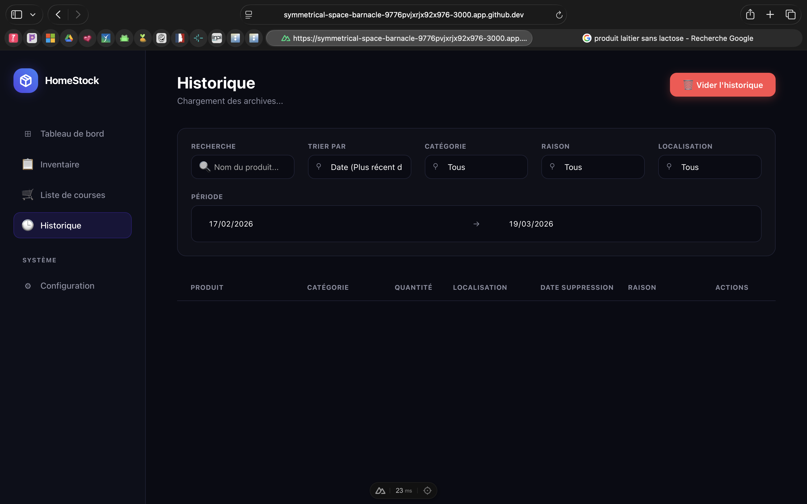
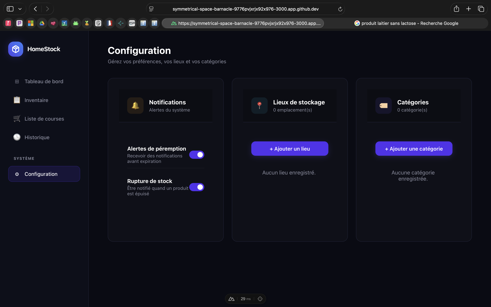

# 🏠 HomeStock

> Ne gaspillez plus jamais. Gérez votre stock domestique comme un pro.

HomeStock est une application **desktop** (Electron + Nuxt.js) qui vous permet de suivre votre inventaire alimentaire, anticiper les péremptions, gérer votre liste de courses et consulter l'historique de consommation.

---

## 👥 Auteurs

| Nom | Rôle | GitHub |
|-----|------|--------|
| **MPETI EBOMA Miradi** | Lead Dev Backend & Electron (Architecture, BDD, IPC, System Tray) | [GitHub](https://github.com/Miradimpeti007) |
| **ALI Walid** | Frontend — Tableau de bord & Inventaire | [GitHub](#) |
| **VEMBA MARTINS Sofia** | Frontend — Liste de courses & Configuration | [GitHub](#) |

---

## 📄 Description

HomeStock répond à un problème du quotidien : on achète des produits qu'on a déjà, on oublie ce qui périme, et on gaspille sans s'en rendre compte.

L'application permet de :
- 📦 Gérer son stock alimentaire en temps réel
- 🔴 Être alerté des produits périmés ou en rupture
- 🛒 Générer automatiquement une liste de courses
- 📊 Visualiser l'état global de son stock sur un tableau de bord
- 📋 Consulter l'historique complet des produits consommés ou jetés
- 🔔 Recevoir des notifications natives du système

### Fonctionnalités Clés

> ⚠️ **Focus Desktop :** L'application utilise **Electron** avec :
> - Un **System Tray** (icône près de l'horloge système)
> - Des **notifications natives** automatiques lors des péremptions ou ruptures de stock
> - Un **Watcher** qui surveille le stock en arrière-plan
> - Une communication **IPC** entre le frontend Nuxt.js et le backend Node.js

* [x] Tableau de bord avec compteurs en temps réel
* [x] Inventaire complet avec gestion des quantités
* [x] Alertes visuelles de péremption (vert/orange/ambre/rouge)
* [x] Réassort automatique (Auto-Refill)
* [x] Liste de courses avec progression et validation
* [x] Page historique — tout ce qui a été consommé ou jeté
* [x] Page de configuration (emplacements, paramètres, notifications)
* [x] System Tray (icône dans la barre système)
* [x] Notifications natives Electron
* [x] Watcher automatique de surveillance du stock
* [x] Architecture Design Atomique (molecules/organisms)

---

## 🎨 Conception & Design

> **[Voir la maquette sur Figma](https://sepia-build-20535071.figma.site)**

L'interface suit un design **dark mode** minimaliste inspiré des applications SaaS modernes.

---

## 📐 Architecture & UML

L'application suit une architecture **MVC** stricte avec **Design Atomique** :
- **Model** : Sequelize + SQLite (6 tables)
- **View** : Nuxt.js 4 + Vue 3 (atoms/molecules/organisms)
- **Controller** : Node.js + IPC Electron (handlers + services)


---

## 🛠 Stack Technique

| Couche | Technologie |
|--------|-------------|
| **Desktop** | Electron 40 |
| **Frontend** | Nuxt.js 4, Vue 3 |
| **State Management** | Pinia |
| **Validation** | VeeValidate |
| **Backend** | Node.js, Sequelize ORM |
| **Base de données** | SQLite |
| **Notifications** | Electron native notifications |
| **System Tray** | Electron Tray API |
| **Versionning** | Git, GitHub |
| **Design** | Figma |

---

## 📸 Démonstration

| Tableau de bord | Liste de courses |
| :---: | :---: |
|  |  |

| Inventaire | Historique |
| :---: | :---: |
|  |  |

| Configuration | |
| :---: | :---: |
|  | |

---

## 🚀 Installation & Lancement

### Prérequis
- Node.js v18+
- npm

### 1. Cloner le dépôt
```bash
git clone https://github.com/Miradimpeti007/HomeStock.git
cd HomeStock
```

### 2. Installer les dépendances backend & Electron
```bash
npm install
```

### 3. Installer les dépendances frontend
```bash
cd nuxt-app
npm install
cd ..
```

### 4. Initialiser la base de données
```bash
node scripts/init_db.js
node scripts/seedDb.js
```

### 5. Lancer l'application Electron (desktop)
```bash
npm start
```

### 6. Lancer uniquement le frontend (développement)
```bash
cd nuxt-app
npm run dev
```

---

## 🤖 Section IA & Méthodologie

### 1. Prompts Utilisés
- "Crée un schéma de base de données SQLite pour une app de gestion de stock avec Sequelize" → Structure des modèles
- "Comment implémenter un System Tray avec Electron ?" → tray.service.js
- "Comment faire communiquer Nuxt.js avec Electron via IPC ?" → Architecture IPC
- "Génère un composant Vue avec une barre de progression dynamique" → Composant liste de courses
- "Comment créer un watcher qui surveille des données en arrière-plan avec Electron ?" → watcher.service.js

### 2. Modifications Manuelles & Debug
- L'IA suggérait d'utiliser localStorage — remplacé par Pinia + IPC Electron
- Le code généré pour les migrations Sequelize utilisait une syntaxe dépréciée — corrigé manuellement
- Les règles métier ont été entièrement codées manuellement
- De nombreux bugs de synchronisation ont nécessité une refonte complète du projet

### 3. Répartition Code IA vs Code Humain

| Partie | IA | Humain |
|--------|-----|--------|
| Boilerplate / Config | 70% | 30% |
| Modèles BDD & Migrations | 30% | 70% |
| Logique Métier | 0% | 100% |
| Interface (UI/UX) | 40% | 60% |
| Architecture IPC + Services Electron | 20% | 80% |

---

## ⚖️ Auto-Évaluation

**Ce qui fonctionne bien :**
- Interface dark mode moderne et cohérente
- Logique métier complète (Auto-Refill, alertes péremption, historique)
- Fonctionnalités desktop natives (System Tray, notifications, watcher)
- Design Atomique bien structuré (molecules/organisms)

**Difficultés rencontrées :**
- Gestion des conflits Git lors du travail en équipe
- Intégration Electron + Nuxt.js (communication IPC complexe)
- Bugs de synchronisation qui ont nécessité de repartir de zéro

**Si c'était à refaire :**
- Définir l'architecture IPC avant de commencer le frontend
- Utiliser Pinia dès le début
- Faire des Pull Requests systématiques
- Mieux répartir les tâches dès le départ

---

## 📄 Licence

MIT License — Libre d'utilisation et de modification.