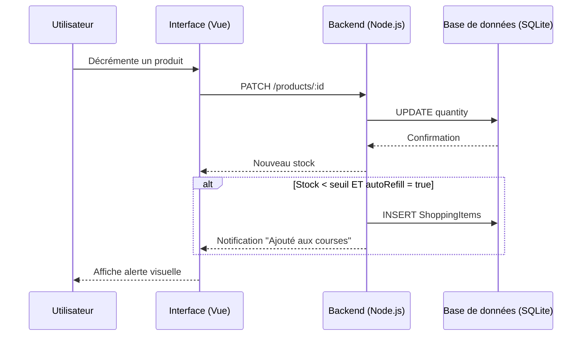
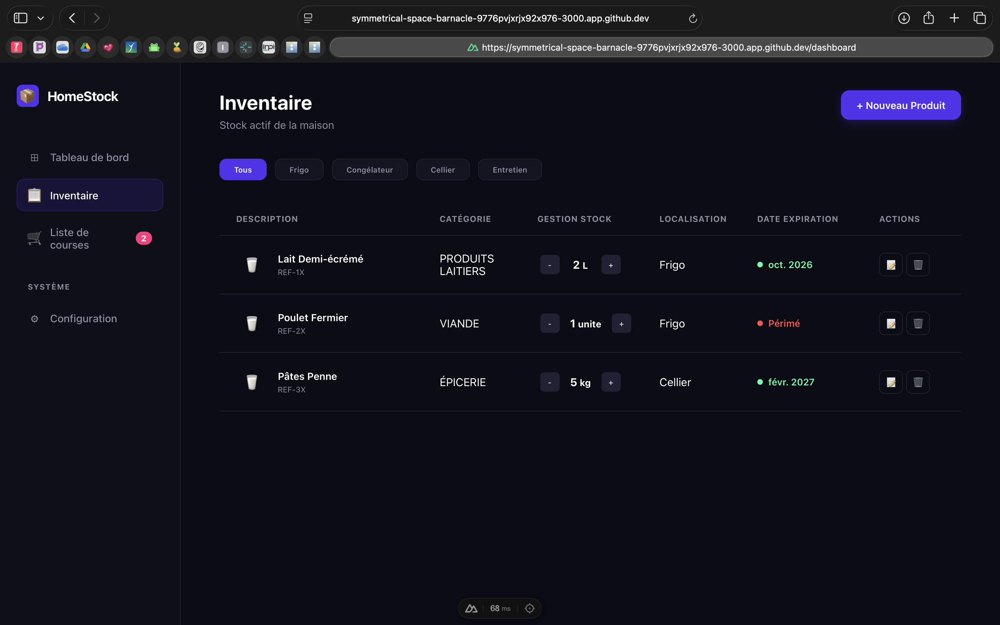
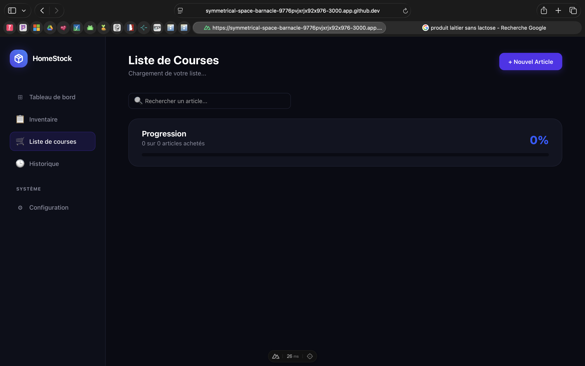
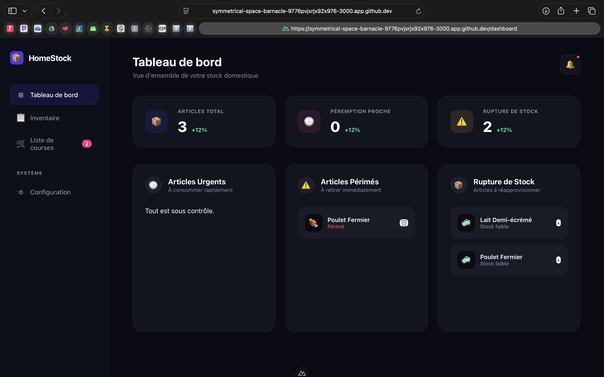
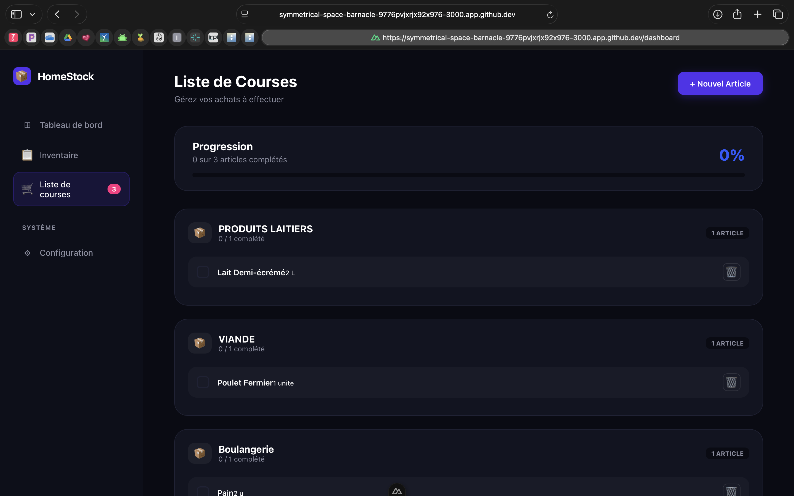

# 🏠 HomeStock

> Gérez votre frigo et vos placards comme un pro.

HomeStock est une application **desktop** (Electron + Nuxt.js) qui vous permet de suivre votre inventaire alimentaire, anticiper les péremptions, gérer votre liste de courses et éviter le gaspillage.

---

## 👥 Auteurs

| Nom | Rôle | GitHub |
|-----|------|--------|
| **MPETI EBOMA Miradi** | Lead Dev Backend & Electron (Architecture, BDD, IPC) | [GitHub](#) |
| **ALI Walid** | Frontend — Tableau de bord & Inventaire | [GitHub](#) |
| **VEMBA MARTINS Sofia** | Frontend — Liste de courses & Configuration | [GitHub](#) |

---

## 📄 Description

HomeStock répond à un problème du quotidien : on achète des produits qu'on a déjà, on oublie ce qui périme, et on gaspille sans s'en rendre compte.

L'application permet de :
- 📦 Gérer son stock alimentaire en temps réel
- 🔴 Être alerté des produits périmés ou en rupture
- 🛒 Générer automatiquement une liste de courses
- 📊 Visualiser l'état global de son stock sur un tableau de bord

### Fonctionnalités Clés

> ⚠️ **Focus Desktop :** L'application utilise **Electron** pour envoyer des **notifications natives** au système d'exploitation lorsqu'un produit est périmé ou en rupture de stock. Elle fonctionne comme une vraie application desktop installée sur la machine.

* [x] Tableau de bord avec compteurs en temps réel
* [x] Inventaire complet avec gestion des quantités
* [x] Alertes visuelles de péremption (vert/orange/ambre/rouge)
* [x] Réassort automatique (Auto-Refill)
* [x] Liste de courses avec progression
* [x] Validation des courses → retour en stock automatique
* [x] Page de configuration (emplacements, notifications)
* [x] Notifications natives Electron
* [ ] Connexion complète Backend ↔ Frontend (en cours)
* [ ] Historique de consommation (à venir)

---

## 🎨 Conception & Design

> **[Voir la maquette sur Figma](https://sepia-build-20535071.figma.site)**

L'interface suit un design **dark mode** minimaliste inspiré des applications SaaS modernes.

---

## 📐 Architecture & UML

L'application suit une architecture **MVC** stricte :
- **Model** : Sequelize + SQLite (5 tables)
- **View** : Nuxt.js + Vue 3 + Tailwind CSS
- **Controller** : Node.js + API REST + IPC Electron

### Diagramme de séquence — Cycle de vie d'un produit


### Schéma de la Base de Données
```
Categories          Locations
├── id              ├── id
├── name            └── name
└── color
        ↑                   ↑
        │                   │
     Products ──────────────┘
     ├── id
     ├── name
     ├── quantity
     ├── minQuantity
     ├── unit (L/kg/ml/mg/unite)
     ├── expirationDate
     ├── autoRefill
     ├── categoryId (FK)
     └── locationId (FK)
         │
         ↓
  ShoppingItems          ConsumedHistories
  ├── id                 ├── id
  ├── name               ├── name
  ├── quantity           ├── consumedDate
  ├── isCompleted        ├── wasThrownAway
  └── linkedProductId    └── categoryId
```

---

## 🛠 Stack Technique

| Couche | Technologie |
|--------|-------------|
| **Desktop** | Electron |
| **Frontend** | Nuxt.js 4, Vue 3, Tailwind CSS |
| **Backend** | Node.js, Sequelize ORM |
| **Base de données** | SQLite |
| **Versionning** | Git, GitHub |
| **Design** | Figma |

---

## 📸 Démonstration

| Tableau de bord | Liste de courses |
| :---: | :---: |
|  |  |

| Inventaire | Configuration |
| :---: | :---: |
|  |  |

---

## 🚀 Installation & Lancement

### Prérequis
- Node.js v18+
- npm

### 1. Cloner le dépôt
```bash
git clone https://github.com/Miradimpeti007/HomeStock.git
cd HomeStock
```

### 2. Installer les dépendances backend
```bash
npm install
```

### 3. Installer les dépendances frontend
```bash
cd app-stock
npm install
```

### 4. Lancer le frontend
```bash
cd app-stock
npm run dev
```

L'application est disponible sur `http://localhost:3000`

### 5. Lancer avec Electron (desktop)
```bash
cd ..
npm run electron
```

---

## 🤖 Section IA & Méthodologie

### 1. Prompts Utilisés
- *"Crée un schéma de base de données SQLite pour une app de gestion de stock avec Sequelize"* → Structure des modèles
- *"Comment faire communiquer Nuxt.js avec Electron via IPC ?"* → Architecture desktop
- *"Génère un composant Vue avec une barre de progression dynamique"* → Composant liste de courses
- *"Explique le pattern MVC appliqué à Electron + Node.js"* → Architecture globale

### 2. Modifications Manuelles & Debug
- L'IA suggérait d'utiliser `localStorage` pour le state — remplacé par un composable Vue partagé (`useStore.js`)
- Le code généré pour les migrations Sequelize utilisait une syntaxe dépréciée — corrigé manuellement
- Les règles métier (Auto-Refill, validation des courses) ont été entièrement codées manuellement

### 3. Répartition Code IA vs Code Humain

| Partie | IA | Humain |
|--------|-----|--------|
| Boilerplate / Config | 70% | 30% |
| Modèles BDD & Migrations | 30% | 70% |
| Logique Métier (Auto-Refill, etc.) | 0% | 100% |
| Interface (UI/UX) | 40% | 60% |
| Architecture IPC Electron | 20% | 80% |

---

## ⚖️ Auto-Évaluation

**Ce qui fonctionne bien :**
- Interface dark mode moderne et cohérente
- Logique métier bien définie (Auto-Refill, alertes péremption)
- Architecture modulaire avec séparation claire des responsabilités
- Bonne gestion des états visuels (vert/orange/ambre/rouge)

**Difficultés rencontrées :**
- Gestion des conflits Git lors du travail en équipe sur les mêmes fichiers
- Intégration Electron + Nuxt.js (communication IPC)
- Synchronisation du state entre les pages sans Pinia

**Si c'était à refaire :**
- Utiliser Pinia dès le début pour le state management
- Définir les routes API avant de commencer le frontend
- Faire des Pull Requests systématiques plutôt que de pusher directement sur `main`

---

## 📄 Licence

MIT License — Libre d'utilisation et de modification.
